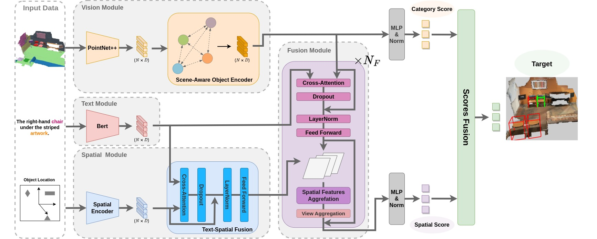

# MiKASA-3DVG (CVPR 24)

 
## 1. Data Preparation
### 1.1. ScanNet Data
To download the ScanNet scans, see [ScanNet](https://github.com/ScanNet/ScanNet#scannet-data) for the instruction.
To preprocess the datarequired for Referit3D challenge, visit [ReferIt3D](https://github.com/referit3d/referit3d).

### 1.2. Referit3D Linguistic Data (Nr3D/Sr3D/Sr3D+)
 See [ReferIt3D](https://github.com/referit3d/referit3d) for more details.
* [**Nr3D**](https://drive.google.com/file/d/1qswKclq4BlnHSGMSgzLmUu8iqdUXD8ZC/view?usp=sharing) (10.7MB)
* [**Sr3D**](https://drive.google.com/drive/folders/1DS4uQq7fCmbJHeE-rEbO8G1-XatGEqNV?usp=sharing) (19MB)
* [**Sr3D+**](https://drive.google.com/drive/folders/1DS4uQq7fCmbJHeE-rEbO8G1-XatGEqNV?usp=sharing) (20MB)
 

### 1.3. Pre-trained weight of Bert
Please down load the pre-trained weight at [Huggingface](https://huggingface.co/bert-base-uncased/tree/main).
### 1.4. Directory Structure

The final required files are as follows:
```
MiKASA/
│────────── logs/ # Training logs
│────────── external_tools/
|           │────────── pointnet2/
|           └── ...
|────────── models/
|────────── scripts/
|           │────────── train_referit3d.py
|           └── ...
|────────── utils/
└── ...
```

## 2. Environment
* Ubuntu: 20.04
* CUDA: 11.7
* PyTorch: 1.13
* python: 3.7

## 3. Installation
For the dependencies please refer [MVT](https://github.com/sega-hsj/MVT-3DVG). Additionally, please install easydict and pyyaml.
* To use a PointNet++ visual-encoder you need to compile its CUDA layers for [PointNet++](http://arxiv.org/abs/1706.02413):
```Note: To do this compilation also need: gcc5.4 or later.```
```Console
    cd external_tools/pointnet2
    python setup.py install
```
## 5. Run
* Firstly please specify the path of scannet_file, referit3D_file, and bert_pretrain_path in the config file.
### 5.1. Training
* To train on either Nr3d or Sr3d dataset, use the following commands
```Console
    python scripts/train_referit3d.py \
    --log-dir $PATH_OF_LOG_AND_CHECKPOINT$ \
    --config-file $PATH_OF_CONFIG$
```
### 5.2. Evaluation
* To evaluate on either Nr3d or Sr3d dataset, plese add the following arguments
```Console
    --resume-path $PATH_OF_CHECKPOINT$ \
    --mode evaluate \
```
### 6. Checkpoints
[Link](https://drive.google.com/drive/folders/1YB6nxjZwnBUyY_qQryjFTKKOhPmGUsFk)

### Citation
```
@inproceedings{chang2024mikasa,
  title={MiKASA: Multi-Key-Anchor \& Scene-Aware Transformer for 3D Visual Grounding},
  author={Chang, Chun-Peng and Wang, Shaoxiang and Pagani, Alain and Stricker, Didier},
  booktitle={Proceedings of the IEEE/CVF Conference on Computer Vision and Pattern Recognition},
  pages={14131--14140},
  year={2024}
}
```


## Credit
The project is built based on the following repository:
* [ReferIt3D](https://github.com/referit3d/referit3d)
* [MVT](https://github.com/sega-hsj/MVT-3DVG)
